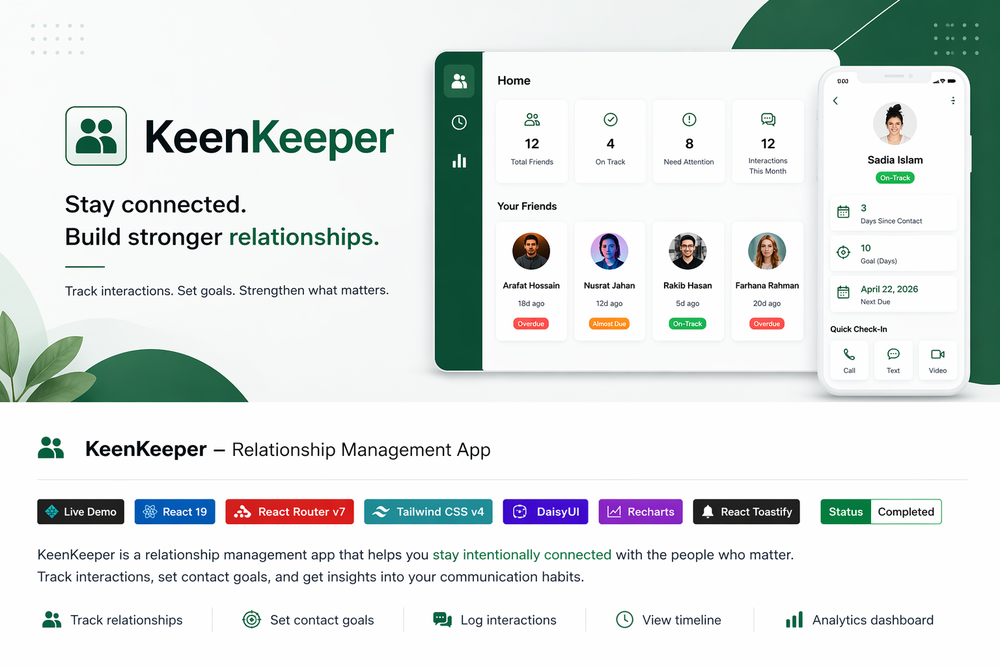

  

<h1 align="center">🤝 KeenKeeper</h1>

A system for intentional relationship management — not social media.

---

---

## 📌 Project Overview

**KeenKeeper** is a relationship management system built to help people stay **intentionally connected**.

Instead of passive interaction, it introduces structure:

* Track relationships
* Set communication goals
* Log interactions
* Analyze behavior

---

## 🔗 Live Demo

👉 https://endearing-pastelito-90f818.netlify.app/

---

## ✨ Key Features

* 👥 Relationship dashboard with friend cards
* ⏱ Days-since-last-contact tracking
* 🎯 Custom contact goals (e.g., every 10 days)
* 🚦 Smart status indicators:

  * On Track
  * Almost Due
  * Overdue
* 📞 Quick interaction logging:

  * Call
  * Text
  * Video
* 🕒 Timeline of interaction history
* 📊 Analytics dashboard (interaction breakdown)
* 🔔 Toast notifications for feedback
* 📱 Fully responsive UI

---

## 🧠 Core Concepts Implemented

* Loader-based data fetching (React Router)
* Derived UI state logic (status calculation)
* Event-driven interaction updates
* Component-based architecture
* Data visualization using charts
* Real-time UI feedback systems

---

## 🛠 Tech Stack

* **React 19**
* **React Router v7**
* **Tailwind CSS v4**
* **DaisyUI**
* **Recharts**
* **React Toastify**
* **React Icons**

---

## 📸 Application Structure

* 🏠 **Dashboard** → Overview + relationship status
* 👤 **Friend Details** → Goals + interaction actions
* 🕒 **Timeline** → History of interactions
* 📊 **Analytics** → Communication insights

---

## 🎯 Problem It Solves

People don’t lose relationships because they don’t care.
They lose them because they **don’t track or maintain them consistently**.

KeenKeeper introduces **structure to human connection**.

---

## 🚀 Future Improvements

* Backend integration (Node / Firebase)
* Persistent database storage
* Authentication system
* Smart reminders (notifications)
* AI-based relationship insights

---

## 👨‍💻 Author

**Raiyan Zannat**
CSE Graduate | MSc Engineering Candidate
Focused on Frontend Systems, AI & Intelligent Applications

---

## 💡 Final Thought

> Most apps help you connect with strangers.
> KeenKeeper helps you **not lose the people who already matter.**
